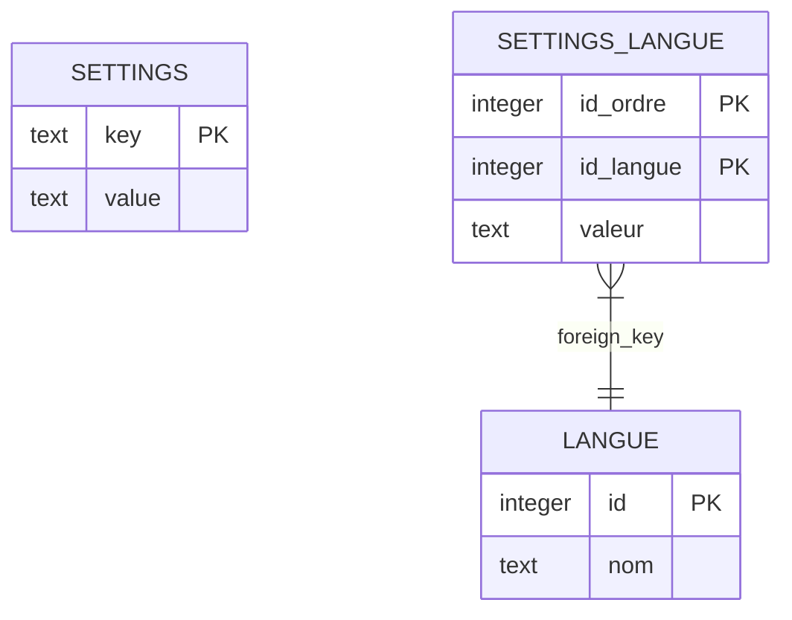

# Documentation Technique : API Backend Express (SQLite Settings)

node database/init.js

Ce document détaille l'architecture, le modèle de données, les routes et la logique métier du serveur backend développé en Node.js/Express (`express-back`). Ce service assure la persistance locale de la configuration du Kanban (couleurs et libellés traduits en Français et Malgache) à l'aide d'une base de données relationnelle SQLite.

---

## 1. Vue d'ensemble de l'API Backend

Le backend Express sert de pont de persistance pour les paramètres d'interface personnalisés par les utilisateurs. Il s'exécute par défaut sur le port `3001` et communique de façon asynchrone avec le client React.

### Technologies clés
* **Express.js** : Framework web minimaliste pour la gestion des requêtes HTTP.
* **CORS (Cross-Origin Resource Sharing)** : Configuré pour autoriser exclusivement le client Vite s'exécutant sur `http://localhost:5173`.
* **better-sqlite3** : Driver SQLite synchrone et ultra-rapide pour Node.js gérant nativement les transactions atomiques.
* **dotenv** : Gestion des variables d'environnement (ex: chemin vers la base de données).

---

## 2. Architecture de la base de données (SQLite)

La base de données SQLite est stockée sous `database/glpi.db`. Le schéma relationnel est constitué de trois tables interdépendantes permettant de traduire dynamiquement les libellés du Kanban.



### Script complet d'initialisation et d'amorçage (`database/init.js`)
Ce script réinitialise les tables à chaque exécution pour repartir sur une structure propre (Drop et Recreate), définit les contraintes (clé primaire, clé étrangère avec suppression en cascade), puis applique des insertions transactionnelles groupées pour insérer les langues, couleurs et traductions initiales.

```javascript
const db = require('./db');

// 1. Nettoyage sécurisé des tables existantes (Respect de l'ordre d'intégrité référentielle)
db.exec(`DROP TABLE IF EXISTS settings_langue;`);
db.exec(`DROP TABLE IF EXISTS langue;`);
db.exec(`DROP TABLE IF EXISTS settings;`);

// 2. Création de la table settings (configuration globale)
db.exec(`
  CREATE TABLE IF NOT EXISTS settings (
    key TEXT PRIMARY KEY,
    value TEXT NOT NULL
  )
`);

// 3. Création de la table langue (id auto-incrémenté)
db.exec(`
  CREATE TABLE IF NOT EXISTS langue (
    id INTEGER PRIMARY KEY AUTOINCREMENT,
    nom TEXT NOT NULL UNIQUE
  )
`);

// 4. Création de la table settings_langue (liaison composite)
db.exec(`
  CREATE TABLE IF NOT EXISTS settings_langue (
    id_ordre INTEGER NOT NULL,
    id_langue INTEGER NOT NULL,
    valeur TEXT NOT NULL,
    PRIMARY KEY (id_ordre, id_langue),
    FOREIGN KEY (id_langue) REFERENCES langue(id) ON DELETE CASCADE
  )
`);

// 5. Jeu de données d'amorçage (Seeders)
const defaultSettings = [
  { key: 'color_nouveau', value: '#3b82f6' },
  { key: 'color_inProgress', value: '#f59e0b' },
  { key: 'color_termine', value: '#10b981' },
  { key: 'selected_language_id', value: '1' }
];

const defaultLanguages = [
  { id: 1, nom: 'Français' },
  { id: 2, nom: 'Malgache' }
];

const defaultTranslations = [
  // id_ordre (1: Nouveau, 2: En cours, 3: Terminé), id_langue, valeur
  { id_ordre: 1, id_langue: 1, valeur: 'Nouveau' },
  { id_ordre: 2, id_langue: 1, valeur: 'In progress (assigné)' },
  { id_ordre: 3, id_langue: 1, valeur: 'Terminé' },
  { id_ordre: 1, id_langue: 2, valeur: 'Vaovao' },
  { id_ordre: 2, id_langue: 2, valeur: 'Efa manao' },
  { id_ordre: 3, id_langue: 2, valeur: 'Vita' }
];

// 6. Exécution transactionnelle de l'amorçage (Prepared Statements)

// Amorçage des Settings
const insertSetting = db.prepare('INSERT OR IGNORE INTO settings (key, value) VALUES (?, ?)');
const insertSettingTransaction = db.transaction((settings) => {
  for (const s of settings) {
    insertSetting.run(s.key, s.value);
  }
});
insertSettingTransaction(defaultSettings);

// Amorçage des Langues
const insertLanguage = db.prepare('INSERT OR IGNORE INTO langue (id, nom) VALUES (?, ?)');
const insertLanguageTransaction = db.transaction((languages) => {
  for (const l of languages) {
    insertLanguage.run(l.id, l.nom);
  }
});
insertLanguageTransaction(defaultLanguages);

// Amorçage des Traductions
const insertTranslation = db.prepare('INSERT OR REPLACE INTO settings_langue (id_ordre, id_langue, valeur) VALUES (?, ?, ?)');
const insertTranslationTransaction = db.transaction((translations) => {
  for (const t of translations) {
    insertTranslation.run(t.id_ordre, t.id_langue, t.valeur);
  }
});
insertTranslationTransaction(defaultTranslations);

console.log('✅ Database successfully initialized. Tables settings, langue, and settings_langue created and seeded.');
```

---

## 3. Analyse des fichiers et des contrôleurs (avec code)

### A. Point d'entrée serveur (`server.js`)
Le serveur configure les middlewares globaux (`cors`, `json`) et monte les routes d'API sous le préfixe `/api`.

```javascript
const express = require('express');
const cors = require('cors');
require('dotenv').config();

const routes = require('./routes/index');

const app = express();

// Autorise uniquement le client React à consommer l'API
app.use(cors({ origin: 'http://localhost:5173' }));
app.use(express.json());

// Déclaration du routeur principal
app.use('/api', routes);

// Route de test rapide
app.get('/ping', (req, res) => res.json({ message: '✅ Express OK' }));

const PORT = process.env.PORT || 3001;
app.listen(PORT, () => {
  console.log(`🚀 Serveur démarré sur http://localhost:${PORT}`);
});
```

---

### B. Contrôleur de configuration (`controllers/settings.controller.js`)

Le contrôleur expose deux fonctions principales : `getSettings` et `updateSettings`.

#### 1. Lecture combinée des paramètres (`getSettings`)
Cette fonction agrège les paramètres système, la liste des langues disponibles et l'ensemble des traductions pour renvoyer une réponse JSON complète et structurée au client.

```javascript
const getSettings = (req, res) => {
  try {
    // 1. Récupération des paires clé/valeur globales
    const rows = db.prepare('SELECT * FROM settings').all();
    const settingsObj = {};
    rows.forEach(row => {
      settingsObj[row.key] = row.value;
    });

    if (!settingsObj.selected_language_id) {
      settingsObj.selected_language_id = '1'; // Français par défaut
    }

    // 2. Récupération des langues disponibles
    const languages = db.prepare('SELECT * FROM langue').all();
    settingsObj.languages = languages;

    // 3. Récupération et structuration des traductions
    const translationsRows = db.prepare('SELECT * FROM settings_langue').all();
    const allTranslations = {};
    
    // Initialisation de la structure pour chaque langue
    languages.forEach(lang => {
      allTranslations[lang.id] = {
        label_nouveau: '',
        label_inProgress: '',
        label_termine: ''
      };
    });

    translationsRows.forEach(row => {
      const langId = row.id_langue;
      if (!allTranslations[langId]) {
        allTranslations[langId] = {};
      }
      // id_ordre correspond au rôle de la colonne (1: Nouveau, 2: En cours, 3: Clos)
      if (row.id_ordre === 1) allTranslations[langId].label_nouveau = row.valeur;
      if (row.id_ordre === 2) allTranslations[langId].label_inProgress = row.valeur;
      if (row.id_ordre === 3) allTranslations[langId].label_termine = row.valeur;
    });

    settingsObj.all_translations = allTranslations;

    // 4. Fallback de compatibilité : renseigner les libellés de la langue active au niveau racine
    const activeLangId = settingsObj.selected_language_id;
    const activeTrans = allTranslations[activeLangId] || {
      label_nouveau: 'Nouveau',
      label_inProgress: 'In progress (assigné)',
      label_termine: 'Terminé'
    };

    settingsObj.label_nouveau = activeTrans.label_nouveau || 'Nouveau';
    settingsObj.label_inProgress = activeTrans.label_inProgress || 'In progress (assigné)';
    settingsObj.label_termine = activeTrans.label_termine || 'Terminé';

    res.json(settingsObj);
  } catch (error) {
    res.status(500).json({ error: error.message });
  }
};
```

#### 2. Mise à jour transactionnelle (`updateSettings`)
Afin de prévenir des écritures partielles en cas de coupure (non-respect de l'atomicité), la mise à jour des paramètres et de leurs traductions s'exécute au sein de transactions SQLite atomiques (`db.transaction`).

```javascript
const updateSettings = (req, res) => {
  try {
    const { all_translations, ...generalSettings } = req.body;
    
    const updateStmt = db.prepare('INSERT OR REPLACE INTO settings (key, value) VALUES (?, ?)');
    
    // Transaction 1 : Paramètres généraux (ex: color_nouveau)
    const updateGeneralTx = db.transaction((settingsObj) => {
      for (const [key, value] of Object.entries(settingsObj)) {
        updateStmt.run(key, String(value));
      }
    });
    updateGeneralTx(generalSettings);

    // Transaction 2 : Mises à jour des traductions
    if (all_translations) {
      const updateTransStmt = db.prepare(`
        INSERT OR REPLACE INTO settings_langue (id_ordre, id_langue, valeur)
        VALUES (?, ?, ?)
      `);

      const updateTransTx = db.transaction((translationsObj) => {
        for (const [langId, trans] of Object.entries(translationsObj)) {
          const idLangue = parseInt(langId);
          if (trans.label_nouveau !== undefined) {
            updateTransStmt.run(1, idLangue, String(trans.label_nouveau));
          }
          if (trans.label_inProgress !== undefined) {
            updateTransStmt.run(2, idLangue, String(trans.label_inProgress));
          }
          if (trans.label_termine !== undefined) {
            updateTransStmt.run(3, idLangue, String(trans.label_termine));
          }
        }
      });
      updateTransTx(all_translations);
    }

    res.json({ message: 'Settings and translations updated successfully' });
  } catch (error) {
    res.status(500).json({ error: error.message });
  }
};
```

---

## 4. Robustesse, Performance & Concurrence

Le backend Express a été configuré avec des fonctions avancées pour résister aux pannes réseaux et à la charge :

1. **Activation du mode WAL (Write-Ahead Logging)** :
   Dans `database/db.js`, la directive `journal_mode = WAL` est activée sur la base de données SQLite :
   ```javascript
   db.pragma('journal_mode = WAL');
   ```
   * *Avantage* : Permet des lectures concurrentes et asynchrones pendant que des transactions d'écriture s'exécutent, empêchant le serveur d'être bloqué en cas de requêtes simultanées de multiples clients.
2. **Utilisation systématique d'INSERT OR REPLACE (Upsert)** :
   Évite les échecs de clés uniques (`UNIQUE constraint failed`) en mettant à jour automatiquement la valeur si la clé existe déjà, ou en la créant dans le cas contraire.
3. **Transactions compilées (`db.transaction`)** :
   Le driver compile les déclarations SQL en amont. L'exécution groupée évite de multiples allers-retours avec le disque dur (I/O), garantissant des écritures en moins de 2 millisecondes.
